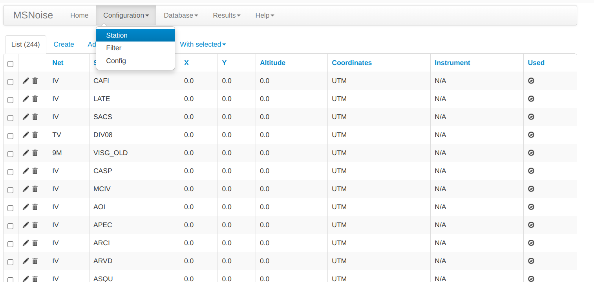

# Docker compose file e Dockerfile per MSNoise
## Contenuto
Questa cartella contiene il file per istanziare il container con MSNoise e MariaDB. 

## Come fare

### Avvio dei container
Dall'interno di questa cartella eseguendo il comando

```
docker compose up -d
```
verranno creato il container con il servizio definito nel file.

Eseguendo il comando

```
docker compose ps
```

ci si aspetta di trovare nell'output del comando una riga con il nome del container ed altri campi, tra cui lo STATUS con valore 'UP'.

Se non fosse cosi' e' possibile che ci siano stati degli errori e quindi il container non sia stato istanziato correttamente.

Eseguendo il comando 

```
docker compose ps -a 
```
si dovrebbe trovare nella riga relativa al container uno STATUS di tipo 'Exited'.

A questo punto si potrebbe eseguire il comando

```
docker compose logs  
```
per provare a capire qual e' stato il motivo che ha impedito al container di essere correttamente istanziato.

### Stop e rimozione dei container
Dall'interno di questa cartella eseguire il comando

```
docker compose down
```

In questo modo, tutti i container istanziati sulla base del file docker-compose.yml verranno fermati e rimossi, incluse le reti definite nel file. Rimarranno soltanto i volumi nella cartella /var/lib/docker/volumes .

Il comando 

```
docker compose stop
```

ferma, senza rimuoverlo, il container.

Per ogni altro approfondimento si rimanda alla documentazione ufficiale di docker compose al link https://docs.docker.com/compose/reference/ .

## Configurazione e avvio di MSNoise

Una volta istanziato il container e' possibile accedervi con 

```
docker exec -it msnoise bash
```

Verificarne lo status del database con 

```
service mariadb status
```

Eseguire lo script sql per la creazione dello schema, delle tabelle
e dell'utente di MSNoise. Dalla cartella /home/msnoise eseguire 

```
mariadb < create_schema_user_and_grants.sql
```

A questo punto e' possibile eseguire 

```
msnoise db init
```

che avviera' un prompt interattivo dove bisognera' selezionare l'opzione 2 per mysql e digitare
la password 'msnoise'. Tutte le altre opzioni possono essere lasciate con il valore di default premendo il tasto
invio. Al termine della procedura verra' creato il file db.ini.

Per avviare l'interfaccia grafica da cui configurare MSNoise si dovra' eseguire

```
msnoise admin &
```

Questa sara' raggiungible sulla porta 5000 del server su cui e' stato istanziato il container.

## Configurazione data_folder e data_structure

Dal tab Configuration selezionare config


Nella schermata successiva editare data_folder aggiungendo il path del container su cui e' stato montato l'archivio SDS (nel nostro caso /remote-sds-archive).


Adesso e' possibile eseguire il comando

```
msnoise populate
```

per aggiungere le network e le stazioni trovate nell'archivio SDS all'interno delle tabelle di MSNoise.

Se il comando sara' stato eseguito correttamente nella sezione Station del tab Configuration saranno elencate le stazioni 



## Cosa fare se

Nel caso in cui il browser non sia in grado di restituire la pagina di amministrazione entrare nel container con

```
docker exec -it msnoise bash
```

eseguire il comando

```
top
```

ed ottenuto il PID del processo msnoise eseguire


```
kill -9 $PID
```

Questo consente di arrestare il processo. Il comando "top" non dovrebbe piu' mostrare il processo
msnoise nell'elenco.
A questo punto riavviare l'interfaccia di amministrazione con 

```
msnoise admin &
```